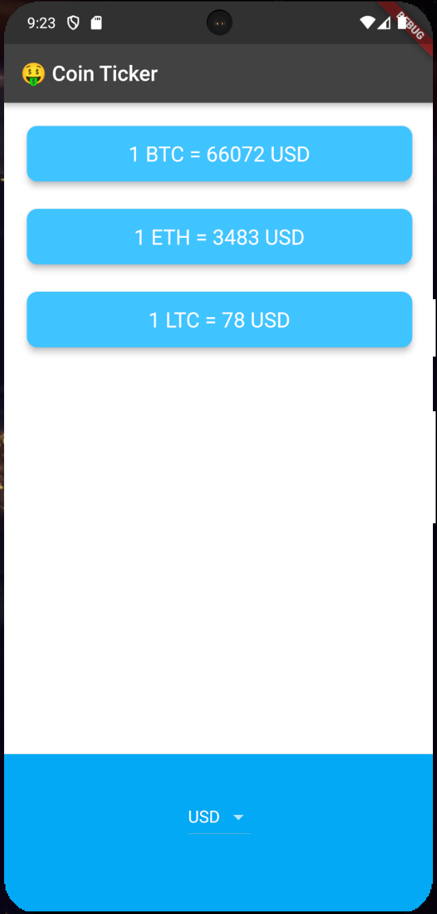
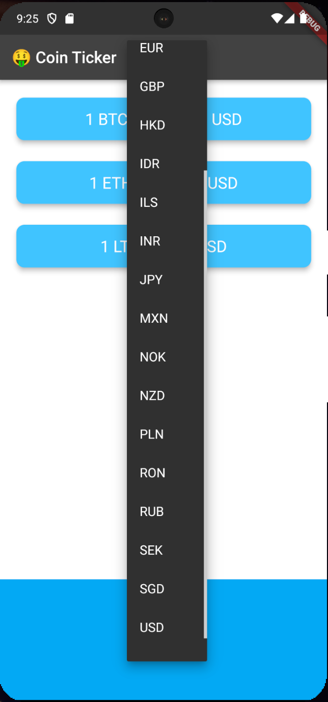
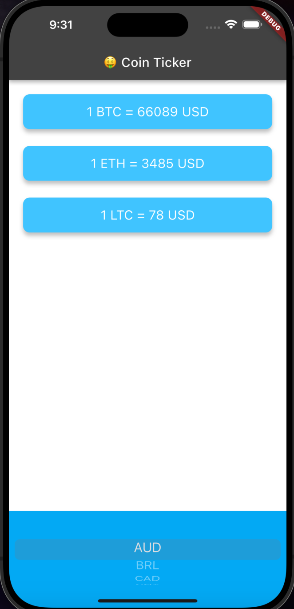

# Bitcoin Tracker App

### [Link to flutter tutorial](https://www.udemy.com/course/flutter-bootcamp-with-dart/?couponCode=OF53124)

## Overview:
- The bitcoin tracker application allows a user to track the current prices in various currencies for cryptocurrencies such as Bitcon, Ethereum, and Litecoins. 

## What I learn about flutter/dart with project: 
- Future, Async & Await
- Dart Loops
- Platform specific UI Components (ios & android)

## Screenshots: 

  
   
  
  

## Installation/Running steps :computer: :
### :warning: To run project you need a CoinApi API key :warning:

- [Link to creating CoinApi account and API key](https://www.coinapi.io/market-data-api/pricing)

### Adding environment file
- Create `.env` file in the root of the project 
- Insert this `API_KEY='<coinapi_api_key>'` into file
- Replace <> tag with your open weather api key

### Running project
- Add [Flutter](https://docs.flutter.dev/get-started/install) to your machine
- Open this project folder with Terminal/CMD and run `flutter packages get`
- Run `flutter run` to build and run the debug app on your emulator/phone

